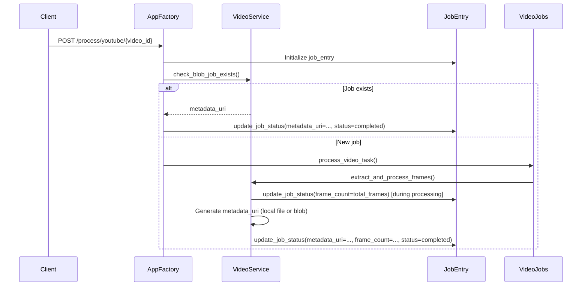

# Streaming Updates to Consumers

This document details how job progress updates are streamed to consumers using Server-Sent Events (SSE) and describes the shapes of the types involved.

## Overview

The Slides Extractor service provides real-time progress updates for video processing jobs using Server-Sent Events. This allows clients to monitor job status without polling.

## Streaming Mechanism

### Endpoint

```
GET /jobs/{video_id}/stream
```

- **Authentication**: Requires API password via Bearer token
- **Response Type**: `text/event-stream`
- **Connection**: Persistent HTTP connection that streams events until job completion or failure

### Implementation Flow

1. **Client Connection**: Client connects to the streaming endpoint
2. **Stream Creation**: Server creates a `StreamingResponse` wrapping an async generator
3. **State Monitoring**: The generator polls the job state once per second
4. **Event Generation**: When job state changes, an SSE event is sent to the client
5. **Completion**: Streaming stops when job reaches "completed" or "failed" status
6. **Timeout**: Connection closes after 300 seconds (5 minutes) of inactivity

## Server-Sent Events Format

The streaming endpoint uses the standard SSE format:

```
data: <json-payload>\n\n
```

Where `<json-payload>` is a JSON-serialized job state object.

### Example SSE Event

```http
data: {"status": "extracting", "message": "Analyzing frames: 12 segments detected", "updated_at": "2023-12-20T23:03:00.123456+00:00", "frame_count": 2400, "current_frame": 1200}\n\n
```

## Type Definitions

### Job State Object

The primary data structure streamed to clients:

```typescript
interface JobState {
  /** Current processing status */
  status: "pending" | "downloading" | "extracting" | "uploading" | "completed" | "failed";

  /** Human-readable status message */
  message: string;

  /** ISO 8601 timestamp of last update */
  updated_at: string;

  /** URL to job metadata (available when status is "completed") */
  metadata_uri?: string | null;

  /** Error message (available when status is "failed") */
  error?: string | null;

  /** Total number of frames in the video */
  frame_count?: number | null;

  /** Current frame being processed (during extracting phase) */
  current_frame?: number | null;

  /** Number of slides processed so far (during uploading phase) */
  slides_processed?: number | null;

  /** Total number of slides to upload (during uploading phase) */
  total_slides?: number | null;
}
```

### JobStatus Enum

Defined in `src/slides_extractor/video_service.py`:

```python
class JobStatus(str, Enum):
    pending = "pending"          # Job created, waiting to start
    downloading = "downloading"  # Downloading video/audio streams
    extracting = "extracting"    # Extracting frames and detecting slides
    uploading = "uploading"      # Uploading slides to storage
    completed = "completed"      # Job finished successfully
    failed = "failed"            # Job encountered an error
```

### Progress States

The system tracks job progress through specific fields depending on the status:

1. **Overall Job Status**: Tracked via the `status` field (pending → downloading → extracting → uploading → completed/failed)
2. **Download Progress**: Tracked separately in `job_tracker.py` for individual files via `/progress` endpoint
3. **Frame Analysis Progress**: Tracked via `current_frame` and `frame_count` fields during extraction
4. **Upload Progress**: Tracked via `slides_processed` and `total_slides` fields during upload

## Implementation Details

### Thread Safety

- Job state is stored in a global `JOBS` dictionary
- Access is protected by `JOBS_LOCK` (asyncio.Lock)
- All state updates use the `update_job_status()` function for thread-safe operations

### Polling and Updates

```python
# From stream_job_progress() in video_service.py
while True:
    async with JOBS_LOCK:
        job_state = JOBS.get(video_id)
        if job_state is None:
            raise KeyError(f"Job not found: {video_id}")

    updated_at = job_state.get("updated_at")
    if updated_at != last_update:
        yield f"data: {json.dumps(job_state)}\n\n"
        last_update = updated_at
        last_activity = datetime.now(timezone.utc)

    # Check for completion
    if status_value.lower() in {JobStatus.completed.value, JobStatus.failed.value}:
        break

    # Timeout protection
    if (datetime.now(timezone.utc) - last_activity).total_seconds() >= 300:
        raise TimeoutError(f"No updates for job {video_id} in the last 300 seconds")

    await asyncio.sleep(1)
```

### Error Handling

The streaming system handles several error conditions:

1. **Job Not Found**: Returns 404 if job doesn't exist
2. **Timeout**: Raises TimeoutError after 300 seconds of inactivity
3. **Connection Errors**: SSE error events sent for exceptions
4. **Job Completion**: Gracefully closes connection on success/failure

## Client Usage Example

```javascript
// JavaScript client example
const eventSource = new EventSource(`/jobs/${videoId}/stream`);

eventSource.onmessage = (event) => {
  const jobState = JSON.parse(event.data);
  
  // Display status message
  console.log(`Status: ${jobState.status} - ${jobState.message}`);
  
  // Show progress based on current phase
  if (jobState.status === 'extracting' && jobState.current_frame && jobState.frame_count > 0) {
    const percent = (jobState.current_frame / jobState.frame_count) * 100;
    console.log(`Frame analysis: ${Math.round(percent)}% (${jobState.current_frame}/${jobState.frame_count} frames)`);
  } else if (jobState.status === 'uploading' && jobState.slides_processed && jobState.total_slides > 0) {
    const percent = (jobState.slides_processed / jobState.total_slides) * 100;
    console.log(`Upload: ${Math.round(percent)}% (${jobState.slides_processed}/${jobState.total_slides} slides)`);
  }

  if (jobState.status === 'completed') {
    console.log('Job completed! Metadata:', jobState.metadata_uri);
    eventSource.close();
  } else if (jobState.status === 'failed') {
    console.error('Job failed:', jobState.error);
    eventSource.close();
  }
};

eventSource.onerror = (error) => {
  console.error('Streaming error:', error);
  eventSource.close();
};
```

## Performance Characteristics

- **Update Frequency**: Maximum 1 update per second (polling interval)
- **Connection Duration**: Typically lasts from job start to completion (minutes to hours)
- **Memory Usage**: Minimal - only current job state is kept in memory
- **Scalability**: Multiple clients can connect to the same job stream simultaneously

## Related Endpoints

- `GET /jobs/{video_id}` - Get current job status (polling alternative)
- `GET /progress` - Get download progress for all active downloads
- `POST /process/youtube/{video_id}` - Start a new job

## Best Practices for Clients

1. **Reconnection**: Implement automatic reconnection logic for interrupted streams
2. **Error Handling**: Handle both SSE errors and job failure states
3. **Progress Display**: 
   - During `extracting`: Use `current_frame / frame_count` for progress bars
   - During `uploading`: Use `slides_processed / total_slides` for progress bars
4. **Status Messages**: Display `message` field for detailed status updates
5. **Completion Handling**: Check `metadata_uri` when job completes for results


## Call Chain for job_entry['metadata_uri'] and job_entry['frame_count']

Here's the call chain for how job_entry['metadata_uri'] and job_entry['frame_count'] are updated:

### 1. Initial Job Creation

   * Location: src/slides_extractor/app_factory.py
   * Function: process_youtube_video()
   * Action: Creates initial job entry with default values

### 2. Frame Count Updates During Processing

   * Location: src/slides_extractor/video_service.py
   * Function: _detect_static_segments()
   * Action: Updates frame_count during frame analysis with total_frames value
   * Call: update_job_status(..., frame_count=total_frames)

### 3. Final Updates on Completion

   * Location: src/slides_extractor/video_service.py
   * Function: extract_and_process_frames()
   * Action: Sets final values for both metadata_uri and frame_count when job completes
   * Call: update_job_status(..., frame_count=total_frames_seen, metadata_uri=metadata_uri)

### 4. Metadata URI Generation

   * Location: src/slides_extractor/video_service.py
   * Function: extract_and_process_frames()
   * Action: Generates metadata_uri either as local file URI or Vercel Blob URL
   * Logic:
       * If local_output_dir: Creates file URI like file:///path/to/manifest.json

       * Otherwise: Uploads to Vercel Blob and gets URL via upload_to_blob()

### 5. Existing Job Check

   * Location: src/slides_extractor/app_factory.py
   * Function: process_youtube_video()
   * Action: Checks if job already exists via check_blob_job_exists()
   * If exists: Sets metadata_uri from existing blob and marks job as completed

### 6. Job Status Update Mechanism

   * Location: src/slides_extractor/video_service.py
   * Function: update_job_status()
   * Action: Core function that updates job_entry dictionary with all values including:
       * job_entry["metadata_uri"] = metadata_uri

       * job_entry["frame_count"] = frame_count

## Summary Diagram



The key functions involved are:

   1. update_job_status() - Core update mechanism
   2. extract_and_process_frames() - Main processing function that sets final values
   3. _detect_static_segments() - Updates frame_count during analysis
   4. check_blob_job_exists() - Checks for existing metadata URI

Both values are ultimately stored in the global JOBS dictionary and accessed via the job tracking system.
